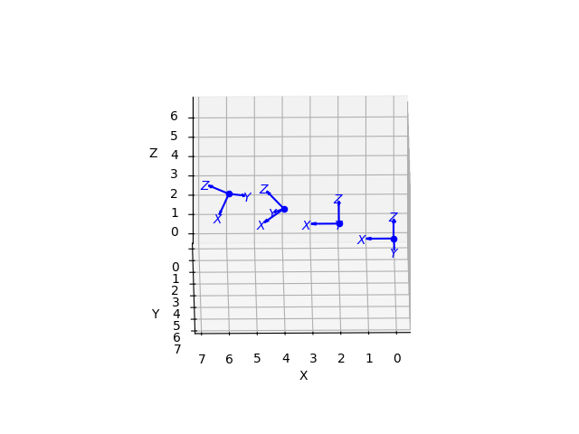

# Part 1 (Warm-up): Expressing Spatial Information Mathematically
## Refer to *spatial_information.py*.

In this script, we experiment with SE(3) objects of different translation and rotation.

Below are the results we get from running the script:

As we can see, the center two points are rotated differently,
which we would expect since we set the rotation of the points to different values.

As the code uses RPY rotation, rotation is done along the z-axis first, followed by the y-axis, then x-axis.
By dragging the mouse on the images we obtain to view it from different angles, we are able to see this is action!

For the first image, we note that the point at (4, 4), ignoring translation, is a rotation about the y-axis
of the point at (2, 2), as seen below, with the y-axes parallel to each other for both points:

We also note that the point at (6, 6), ignoring translation, is a rotation about the x-axis
of the point at (4, 4), as seen below, with the x-axes parallel to each other for both points:

This is to be expected since the z-axis rotation happens before the y-axis rotation, which happens before the x-axis rotation,
and the points from (0, 0) to (6, 6) adds a rotation about an axis in that order.

Meanwhile, for the second image, we note that the point at (4, 4), ignoring translation, is *NOT* a rotation about the y-axis
of the point at (2, 2), as seen below, with the y-axes *NOT* parallel to each other for both points:

This is interesting as the point at (4, 4) was rotated using the matrix used by the point at (2, 2), just with an added pitch angle. 

We also note that the point at (6, 6), ignoring translation, is *NOT* a rotation about the z-axis
of the point at (4, 4), as seen below, with the z-axes *NOT* parallel to each other for both points:

We have now seen that it is important to consider the order of rotation.
Overall, this was a good exercise in understanding the spatialmath library and Homogeneous transformations.

# Part 2: Visualising a Camera Wireframe in Open3D

In this part, we shall play around with the Open3D library to create a wireframe and animate it.
We have a script called *lineset_init.py* that contains a function that 
returns a LineSet object representing the camera.
From the script, we can see the camera is represented by a 1x1 square, with a 5th point 
0.25 distance away from the center of the square, to form a square pyramid.

While translating a wireframe is simple (just pass in the translation values to a translate function),
when we do rotation, we need to be aware of our axis point of rotation.
More specifically, if we were to naively apply rotation matrices to a point, it will just rotate about the origin.
So if we wanted to rotate about a different point (like the fifth point in the camera),
we need to consider the position of the point.

With our knowledge of Homogeneous transformations, every transformation is done by performing
a left multiplication of the relevant transformation matrix to the current transform.
Suppose our axis point of rotation is represented by the matrix H.
Then, we can translate the entire space by H to make the origin at point H.
We do this by translating the points we want to rotate by H-1.
We can now perform the rotation, since we want to rotate about this new origin.
Then, to restore the graph back, we can translate the space by H-1.
Once again, we do this by translating the points we rotated by H. This gives us the desired effect.

However, what if the point we want to rotate about is moving? We can modify our solution above.
Suppose the point we are rotating about moves from H to H'.
Instead of translating the points we rotated by H to restore the graph,
we can instead translate by H', as H' is the new "origin" we are rotating about.
This gives us a general matrix for performing a rotation as follows:

*H' * R * H-1* 

where R is the rotation matrix.

We can put this information to the test!

In *open3d_rotation_animation.py*, we can see that the camera wireframe rotates
about pyramid apex instead of the origin!

In *camera_animation.py*, we are even able to (somewhat) replicate the movement
of the camera in the video provided! The camera is located at a height 2 above the origin,
while rotating around it, with its path being a circle with radius 3.
As we move the camera, we adjust its rotation such that it is always pointing to the origin
(we define this as having the origin lie on the line between the apex of the pyramid, and the center of its base).

# Learning experience
Through this exercise, I have learnt about how homogeneous transformations
can be performed through the use of matrices. I also learnt about roll, pitch and yaw,
and how the order that these are applied matters. I have also learnt about open3d and spatialmath
Python libraries.

I think what interested me most was the structure of the matrices used in homogeneous transformations.
Translation and rotation information are embedded in the matrix in an easy-to-read way,
while satisfying all the required properties.
